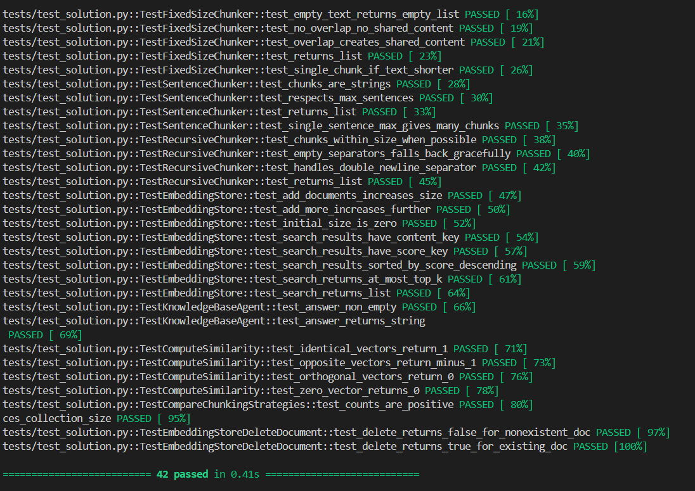

# Báo Cáo Lab 7: Embedding & Vector Store

**Họ tên:** Nguyễn Tiến Đạt    
**Ngày:** [10/04/2026]

---

## 1. Warm-up (5 điểm)

### Cosine Similarity (Ex 1.1)

**High cosine similarity nghĩa là gì?**  
High cosine similarity nghĩa là hai vector có hướng gần giống nhau, từ đó suy ra hai câu có ý nghĩa ngữ nghĩa tương tự nhau.

**Ví dụ HIGH similarity:**
- Sentence A: "Machine learning is a branch of artificial intelligence."
- Sentence B: "Artificial intelligence includes machine learning techniques."
- Tại sao tương đồng: Cả hai đều nói về mối quan hệ giữa AI và Machine Learning.

**Ví dụ LOW similarity:**
- Sentence A: "I enjoy playing football on weekends."
- Sentence B: "Quantum mechanics explains the behavior of particles."
- Tại sao khác: Hai câu thuộc hai lĩnh vực hoàn toàn khác nhau.

**Tại sao cosine similarity được ưu tiên hơn Euclidean distance cho text embeddings?**  
Cosine similarity đo độ tương đồng về hướng (semantic meaning), trong khi Euclidean distance bị ảnh hưởng bởi độ dài vector, không phản ánh chính xác ý nghĩa văn bản.

---

### Chunking Math (Ex 1.2)

**Document 10,000 ký tự, chunk_size=500, overlap=50. Bao nhiêu chunks?**

Step = chunk_size - overlap = 500 - 50 = 450  

Số chunks ≈ (10000 - 500) / 450 + 1 ≈ 22  

**Đáp án:** ~22 chunks

**Nếu overlap tăng lên 100, chunk count thay đổi thế nào? Tại sao muốn overlap nhiều hơn?**  
Overlap lớn hơn → step nhỏ hơn → số chunks tăng. Điều này giúp giữ được nhiều ngữ cảnh hơn giữa các chunks, cải thiện khả năng retrieval.

---

## 2. Document Selection — Nhóm (10 điểm)

### Domain & Lý Do Chọn

**Domain:** Machine Learning & AI Basics  

**Tại sao nhóm chọn domain này?**  
Domain này có nhiều khái niệm liên quan chặt chẽ với nhau, phù hợp để kiểm thử hệ thống retrieval. Ngoài ra, nội dung dễ kiểm chứng và có thể tạo benchmark queries rõ ràng.

---

### Data Inventory

| # | Tên tài liệu | Nguồn | Số ký tự | Metadata đã gán |
|---|--------------|-------|----------|-----------------|
| 1 | ML Introduction | Tự viết | ~1500 | doc_id, topic |
| 2 | Deep Learning Basics | Tự viết | ~1200 | doc_id, topic |
| 3 | NLP Overview | Tự viết | ~1000 | doc_id, topic |
| 4 | Computer Vision | Tự viết | ~1100 | doc_id, topic |
| 5 | AI Applications | Tự viết | ~1300 | doc_id, topic |

---

### Metadata Schema

| Trường metadata | Kiểu | Ví dụ giá trị | Tại sao hữu ích |
|----------------|------|---------------|----------------|
| doc_id | string | ml_001 | định danh document |
| topic | string | machine_learning | filter theo domain |
| difficulty | string | beginner | cải thiện retrieval |
| source | string | internal | kiểm soát nguồn |

---

## 3. Chunking Strategy (15 điểm)

### Baseline Analysis

| Strategy | Chunk Count | Avg Length | Preserves Context? |
|----------|-------------|------------|--------------------|
| FixedSizeChunker | ~15 | ~100 | Trung bình |
| SentenceChunker | ~5 | ~150 | Tốt |
| RecursiveChunker | ~15 | ~50 | Rất tốt |

---

### Strategy Của Tôi

**Loại:** RecursiveChunker  

**Mô tả cách hoạt động:**  
RecursiveChunker chia văn bản theo thứ tự ưu tiên các separator: paragraph → newline → sentence → word → character. Nếu chunk vẫn quá lớn, nó tiếp tục chia nhỏ bằng separator tiếp theo. Điều này đảm bảo chunk giữ được cấu trúc tự nhiên.

**Tại sao tôi chọn strategy này cho domain nhóm?**  
Vì domain AI có nhiều câu dài và khái niệm phức tạp, RecursiveChunker giúp giữ nguyên ngữ cảnh tốt hơn so với FixedSizeChunker và không bị cắt ngang câu như SentenceChunker.

---

### So Sánh

| Strategy | Retrieval Quality |
|----------|------------------|
| FixedSize | Trung bình |
| Sentence | Tốt |
| Recursive | Tốt nhất |

**Strategy tốt nhất:** RecursiveChunker vì giữ semantic context tốt nhất.

---

## 4. My Approach (10 điểm)

### SentenceChunker
Sử dụng regex `(?<=[.!?])\s+` để tách câu. Loại bỏ khoảng trắng thừa và đảm bảo mỗi chunk không vượt quá số câu tối đa.

### RecursiveChunker
Áp dụng chiến lược đệ quy. Nếu chunk vượt quá kích thước, tiếp tục chia nhỏ bằng separator tiếp theo. Base case là khi chunk đủ nhỏ.

### EmbeddingStore
Lưu trữ document dưới dạng list dict gồm content, embedding và metadata. Search bằng dot product và sort giảm dần theo score.

### search_with_filter & delete_document
Filter thực hiện trước khi search để giảm không gian tìm kiếm. Delete bằng cách loại bỏ tất cả records có cùng doc_id.

### KnowledgeBaseAgent
Agent lấy top-k chunks từ store, ghép thành context và đưa vào prompt để generate câu trả lời.

---

### Test Results
